# System Architecture - AI Health Assistant

This document provides a comprehensive overview of the AI Health Assistant system architecture.

## System Overview

The system is a multi-agent health assistant that uses an agentic mesh architecture with specialized AI agents coordinating to provide personalized health advice based on user data. The system features conversation memory, intelligent hybrid routing, domain coverage tracking, and comprehensive data gathering to deliver thorough, personalized health guidance.

### Key Features

- **Conversation Memory**: Session-based context preservation across multiple turns
- **Hybrid Routing (Option C)**: Direct routing for single-domain queries, Triage coordination for multi-domain
- **Domain Coverage Tracking**: Explicit REMAINING:[...] format ensures all aspects addressed
- **Loop Prevention**: Automatic detection and prevention of infinite agent loops
- **Wide Data Retrieval**: Comprehensive biomarker gathering for complete health assessments
- **Batch Tool Execution**: Efficient collection and processing of multiple tool results
- **Real-time Streaming**: Server-Sent Events for live agent activity updates

## Architecture Diagram

```mermaid
flowchart TB
    subgraph FRONTEND ["Frontend Layer - Served on Port 5000"]
        UI["Web UI<br/>index.html + app.js<br/>Session ID Management"]
        UI_STATE["Local Storage<br/>- session_id<br/>- Conversation Persistence"]
        NEW_CHAT["New Chat Button<br/>Session Reset"]
    end

    subgraph BACKEND ["Backend API - Flask Port 5000"]
        API["/api/chat Endpoint<br/>SSE Streaming<br/>Session-aware"]
        FLASK["Flask Web Server<br/>web_app.py<br/>Serves Static Files"]
    end

    subgraph ORCH_LAYER ["Orchestration Layer"]
        ORCH["Orchestrator<br/>orchestration.py<br/>⚡ Loop Prevention<br/>Returns (response, session_id)"]
        SESSION_MGR["Session Manager<br/>- UUID Sessions<br/>- 60min Timeout<br/>- Thread-safe<br/>- Auto Cleanup"]
        CONTEXT["Agent Context<br/>- 💬 Conversation History (Memory)<br/>- User Intent<br/>- Accumulated Findings<br/>- Pending Tasks<br/>- Hop Count"]
    end

    subgraph MESH ["Agent Mesh - Gemini 2.5 Flash"]
        GUARD["Guardrail Agent<br/>🛡️ Safety & Smart Router<br/>Option C: Direct or Triage"]
        TRIAGE["Triage Agent<br/>🔀 Multi-domain Coordinator<br/>📋 Domain Tracking<br/>⚠️ Max 3 calls (loop prevention)"]

        subgraph SPECIALISTS ["Specialist Agents<br/>🎯 Proactive Data Checking"]
            PHYS["Physician<br/>🩺 Wide Biomarker Retrieval<br/>get_biomarkers({})<br/>Smart Range Lookups"]
            NUT["Nutritionist<br/>🥗 Biomarker-First Approach<br/>Checks Physician → Food Journal"]
            FIT["Fitness Coach<br/>💪 Complete Data Gathering<br/>Profile + Activity + Plan"]
            SLEEP["Sleep Doctor<br/>😴 Data-Driven Recommendations<br/>Checks Sleep Data"]
            MIND["Mindfulness Coach<br/>🧘 Knowledge Base Search<br/>Complete Guidance"]
            USER_P["User Persona<br/>👤 Goals & Preferences"]
        end

        CRITIC["Critic Agent<br/>🎓 Synthesis & QA<br/>✅ Completeness Check<br/>⚠️ Loop Prevention (max 1 back-handoff)"]
        REG["Agent Registry<br/>📚 Capabilities Directory"]
    end

    subgraph MCP_LAYER ["MCP Integration Layer<br/>📦 Batch Result Collection"]
        MCP_CLIENT["SimpleMCPClient<br/>- Tool Router & Executor<br/>- Thread-based Async Bridge<br/>- Event Loop Management"]

        subgraph MCP_SERVERS ["MCP Servers - FastMCP + Stdio"]
            USER_DATA_SRV["User Data Server<br/>servers/user_data/main.py<br/>🔧 5 Tools"]
            RESOURCES_SRV["Resources Server<br/>servers/resources/main.py<br/>🔧 4 Tools"]
        end
    end

    subgraph DATA_LAYER ["Data Layer"]
        subgraph USER_DATA ["User Data"]
            BIO_DATA["biomarkers.json<br/>Blood Work"]
            ACT_DATA["activity.json<br/>Exercise Logs"]
            FOOD_DATA["food_journal.json<br/>Meals"]
            SLEEP_DATA["sleep.json<br/>Sleep Tracking"]
            PROFILE_DATA["profile.json<br/>User Profile"]
        end

        subgraph KNOWLEDGE ["Knowledge Resources"]
            RANGES["ranges.json<br/>Reference Ranges"]
            WORKOUTS["workouts.json<br/>Exercise Plans"]
            SUPPS["supplements.json<br/>Supplement Info"]
            KB[("LanceDB<br/>Knowledge Base<br/>Articles & Videos")]
        end
    end

    %% User Flow
    UI -->|"POST /api/chat<br/>message + session_id"| API
    API -->|"SSE Stream<br/>(agent, stream, final, session, done)"| UI
    UI_STATE -.->|"Store/Retrieve<br/>session_id"| UI
    NEW_CHAT -.->|"Clear session_id"| UI_STATE

    %% Backend Processing
    API -->|"run_mesh(msg, session_id)"| ORCH
    ORCH <-->|"Get/Create/Update Session"| SESSION_MGR
    SESSION_MGR <-->|"Conversation History"| CONTEXT
    ORCH -->|"Execute Agent Mesh<br/>Track hop count & sequence"| GUARD

    %% Agent Flow - Option C Hybrid Routing
    GUARD -->|"🎯 Direct: Medical query"| PHYS
    GUARD -->|"🎯 Direct: Nutrition query"| NUT
    GUARD -->|"🎯 Direct: Fitness query"| FIT
    GUARD -->|"🎯 Direct: Sleep query"| SLEEP
    GUARD -->|"🎯 Direct: Mindfulness query"| MIND
    GUARD -->|"🔀 Multi-domain/Holistic"| TRIAGE

    %% Triage Coordination with Domain Tracking
    TRIAGE -->|"Primary + REMAINING:[...]"| PHYS
    TRIAGE -->|"Primary + REMAINING:[...]"| NUT
    TRIAGE -->|"Primary + REMAINING:[...]"| FIT
    TRIAGE -->|"Primary + REMAINING:[...]"| SLEEP
    TRIAGE -->|"Primary + REMAINING:[...]"| MIND

    %% Specialist Collaboration with Domain Coverage
    PHYS -->|"Check REMAINING:<br/>transfer_handoff"| NUT
    PHYS -->|"Check REMAINING:<br/>transfer_handoff"| FIT
    NUT -->|"Need biomarkers:<br/>transfer_handoff"| PHYS
    FIT -->|"Medical clearance:<br/>transfer_handoff"| PHYS
    SLEEP -->|"Check REMAINING:<br/>transfer_handoff"| MIND
    MIND -->|"Check REMAINING:<br/>transfer_handoff"| SLEEP

    %% User Persona Integration
    USER_P -.->|"Align with Goals"| PHYS
    USER_P -.->|"Align with Goals"| NUT
    USER_P -.->|"Align with Goals"| FIT

    %% All Agents to Critic
    PHYS -->|"COMPLETED: domain<br/>REMAINING:[...]"| CRITIC
    NUT -->|"COMPLETED: domain<br/>REMAINING:[...]"| CRITIC
    FIT -->|"COMPLETED: domain<br/>REMAINING:[...]"| CRITIC
    SLEEP -->|"COMPLETED: domain<br/>REMAINING:[...]"| CRITIC
    MIND -->|"COMPLETED: domain<br/>REMAINING:[...]"| CRITIC
    USER_P -->|"Final Handoff"| CRITIC
    TRIAGE -.->|"⚠️ Max 3 calls<br/>Then forced here"| CRITIC

    CRITIC -->|"STOP<br/>Return (response, session_id)"| ORCH
    CRITIC -.->|"⚠️ Once only<br/>If domain missing"| TRIAGE

    %% Context Management - Conversation Memory
    GUARD -.->|"Update findings<br/>Add messages"| CONTEXT
    TRIAGE -.->|"Track domains<br/>Add messages"| CONTEXT
    PHYS -.->|"Update findings<br/>Add messages"| CONTEXT
    NUT -.->|"Update findings<br/>Add messages"| CONTEXT
    FIT -.->|"Update findings<br/>Add messages"| CONTEXT
    SLEEP -.->|"Update findings<br/>Add messages"| CONTEXT
    MIND -.->|"Update findings<br/>Add messages"| CONTEXT
    CRITIC -.->|"Read history<br/>Read findings<br/>Add message"| CONTEXT

    %% Agent Registry
    REG -.->|"Capabilities Info"| GUARD
    REG -.->|"Capabilities Info"| TRIAGE
    REG -.->|"Capabilities Info"| All_Specialists

    %% MCP Tool Calls - Batch Collection
    PHYS -->|"📦 Batch Tool Calls<br/>Wide biomarkers → Targeted ranges"| MCP_CLIENT
    NUT -->|"📦 Batch Tool Calls<br/>Biomarkers + Food Journal"| MCP_CLIENT
    FIT -->|"📦 Batch Tool Calls<br/>Profile + Activity + Plan"| MCP_CLIENT
    SLEEP -->|"📦 Batch Tool Calls<br/>Sleep Data"| MCP_CLIENT
    MIND -->|"📦 Batch Tool Calls<br/>Knowledge Base"| MCP_CLIENT
    USER_P -->|"Tool Calls"| MCP_CLIENT

    %% MCP Server Routing
    MCP_CLIENT -->|"get_biomarkers<br/>get_activity_log<br/>get_food_journal<br/>get_sleep_data<br/>get_user_profile"| USER_DATA_SRV

    MCP_CLIENT -->|"get_biomarker_ranges<br/>get_workout_plan<br/>get_supplement_info<br/>search_knowledge_base"| RESOURCES_SRV

    %% Data Access
    USER_DATA_SRV --> BIO_DATA
    USER_DATA_SRV --> ACT_DATA
    USER_DATA_SRV --> FOOD_DATA
    USER_DATA_SRV --> SLEEP_DATA
    USER_DATA_SRV --> PROFILE_DATA

    RESOURCES_SRV --> RANGES
    RESOURCES_SRV --> WORKOUTS
    RESOURCES_SRV --> SUPPS
    RESOURCES_SRV --> KB

    %% Styling
    classDef frontend fill:#e1f5ff,stroke:#01579b,stroke-width:2px
    classDef backend fill:#f3e5f5,stroke:#4a148c,stroke-width:2px
    classDef agents fill:#fff3e0,stroke:#e65100,stroke-width:2px
    classDef data fill:#e8f5e9,stroke:#1b5e20,stroke-width:2px
    classDef mcp fill:#fce4ec,stroke:#880e4f,stroke-width:2px

    class UI,UI_STATE,NEW_CHAT frontend
    class API,FLASK,ORCH,SESSION_MGR,CONTEXT backend
    class GUARD,TRIAGE,PHYS,NUT,FIT,SLEEP,MIND,USER_P,CRITIC,REG agents
    class BIO_DATA,ACT_DATA,FOOD_DATA,SLEEP_DATA,PROFILE_DATA,RANGES,WORKOUTS,SUPPS,KB data
    class MCP_CLIENT,USER_DATA_SRV,RESOURCES_SRV mcp

```

## Detailed Request Flow

## Agent Communication Protocol

## Technology Stack

## Key Components

### 1. Frontend (`static/`)
- **index.html**: Main UI interface with "New Chat" button
- **app.js**: Client-side logic, SSE handling, session management
  - Stores session_id in localStorage for conversation persistence
  - Sends session_id with each message for context continuity
  - Handles multiple SSE event types (agent, stream, final, session, done)
  - `startNewConversation()` function for session reset
- **style.css**: Modern, responsive styling with dark theme
- Features:
  - Real-time agent status updates showing active agent
  - Streaming responses with character-by-character display
  - Session persistence via localStorage (survives page refresh)
  - New conversation button for starting fresh
  - Example queries for quick start
  - Responsive design for mobile and desktop

### 2. Backend API (`web_app.py`)
- Flask server on port 5000 with CORS enabled
- SSE (Server-Sent Events) streaming for real-time updates
- Thread-based concurrent processing for handling multiple requests
- Captures agent activity and streams to frontend
- Session-aware endpoints:
  - Accepts session_id in request body
  - Returns session_id in response for client storage
  - Passes session_id to orchestrator for context retrieval
- Event types streamed:
  - `agent`: Current agent name
  - `stream`: Incremental response text
  - `final`: Complete response with session_id
  - `session`: Session ID update
  - `done`: Completion signal
  - `error`: Error messages

### 3. Orchestration Layer (`agent_system/`)

**orchestration.py**: Main mesh coordinator
- Manages agent flow through the mesh
- Session-aware: Gets or creates session context
- Returns tuple: (response, session_id)
- **Loop Prevention**: Tracks agent sequence, forces to Critic after 3 Triage calls
- **Hop Count**: 15 hop limit per turn (resets each message)
- **Performance Tracking**: Times each agent, tool, and total execution
- **Agent Sequence Tracking**: Detects patterns like Triage → Critic → Triage loops

**session_manager.py**: Conversation state management  
- **UUID-based sessions**: Unique identifier per conversation
- **60-minute timeout**: Automatic cleanup of inactive sessions
- **Thread-safe operations**: Supports concurrent requests
- **Methods**:
  - `create_session()`: Generates new UUID session
  - `get_session()`: Retrieves or creates session
  - `update_session()`: Saves conversation state
  - `delete_session()`: Cleans up session
  - `_cleanup_old_sessions()`: Automatic timeout handling

**models.py**: Data models (Pydantic)
- **AgentContext**: Shared state across all agents
  - `user_intent`: Original high-level goal
  - `accumulated_findings`: Key discoveries from specialists
  - `pending_tasks`: Outstanding action items
  - `history`: Full conversation as Message objects (enables memory)
  - `hop_count`: Loop prevention counter
- **Message**: Conversation history entry
  - `role`: "user" or "model"
  - `content`: Message text
  - `sender`: Which agent generated it (optional)

### 4. Agent Mesh (`agent_system/agents.py` & `agent_system/base_agent.py`)

**Base Agent Capabilities** (all agents inherit):
- Uses Gemini 2.5 Flash model
- Has specialized system instructions optimized for domain
- Batch tool result collection (collects multiple tool calls)
- Can hand off to other agents via `transfer_handoff` tool
- Updates shared context with findings
- Access to full conversation history for context awareness
- Checks for REMAINING domains in multi-domain requests

**Agent Types & Specific Optimizations:**

1. **Guardrail Agent** - Entry point, safety validation, **Option C hybrid routing**
   - Analyzes query complexity: single-domain vs. multi-domain vs. ambiguous
   - **Direct routing** for clear queries (80% - fastest path)
   - **Triage routing** for multi-domain/ambiguous (20% - ensures completeness)
   - Safety checks: PII redaction, violation detection

2. **Triage Agent** - Multi-domain coordinator with domain tracking
   - Explicit domain tracking: `MULTI-DOMAIN REQUEST: [d1, d2]. Primary: d1. REMAINING: [d2]`
   - Holistic assessment format: `HOLISTIC ASSESSMENT - ALL DOMAINS: [all five domains]`
   - Priority ordering: Medical → Nutrition → Fitness → Sleep → Mental Health
   - Prevents being called more than 3 times (loop prevention)

3. **Physician** - Medical analysis with **wide biomarker retrieval**
   - **Always starts with** `get_biomarkers({})` - gets ALL available biomarkers
   - Smart range lookups: Only for flagged biomarkers (⚠️ High, ⚠️ Low)
   - No redundant calls: Won't retry failed lookups or duplicate calls
   - Collaborates with specialists for interventions

4. **Nutritionist** - Diet planning with **biomarker-first approach**
   - Proactive: Consults Physician for biomarkers before food journal
   - Sequence: Biomarkers (from Physician) → Food journal → Recommendations
   - Domain coverage: Updates REMAINING list, hands off appropriately
   - Complete output: Specific foods, portions, meal timing, practical ideas

5. **Fitness Coach** - Exercise programming with **comprehensive data gathering**
   - **Always checks**: User profile → Activity log → Workout plan
   - Complete plans: Sets × reps, frequency, rest periods, progressive overload, form cues
   - Safety considerations: Adapts to health conditions (e.g., asthma, heart issues)
   - Domain coverage: Checks and updates REMAINING domains

6. **Sleep Doctor** - Sleep optimization with **data-driven recommendations**
   - Proactive: Uses `get_sleep_data()` to analyze actual sleep patterns
   - Personalized: Based on sleep data when available, general guidance when not
   - Domain coverage: Checks REMAINING, hands off to other specialists
   - Explicit handoff instructions to prevent "None" agent errors

7. **Mindfulness Coach** - Stress reduction with **knowledge base integration**
   - Uses `search_knowledge_base()` for meditation techniques and resources
   - Complete guidance: Step-by-step instructions, duration, frequency recommendations
   - Domain coverage: Checks REMAINING domains before finalizing

8. **User Persona** - User goals & preferences integration
   - Provides profile context to other specialists
   - Ensures recommendations align with user goals
   - Consulted by multiple agents for holistic alignment

9. **Critic Agent** - Final synthesis with **completeness checking & loop prevention**
   - Completeness validation: Verifies all REMAINING domains addressed
   - Loop prevention: Limited to 1 back-handoff to Triage (prevents infinite loops)
   - Synthesis: Combines all specialist input into coherent, empathetic response
   - QA: Ensures consistency, no conflicting advice
   - Output: Structured, actionable, references actual user data

### 5. MCP Integration (`agent_system/mcp_client.py`)
- **SimpleMCPClient**: Bridges sync/async gap with threading
- **Server Routing**: Routes tools to appropriate MCP servers (user_data vs resources)
- **Event Loop Management**: Reuses event loops per server to reduce overhead
- **Tool Definitions**: Converts MCP tool schemas to Gemini function declaration format
- **Thread Safety**: Uses locks for concurrent request handling
- **Methods**:
  - `call_tool_sync()`: Synchronous wrapper for async MCP calls
  - `execute_tool()`: Routes to correct server and executes
  - `get_tools_definitions()`: Returns Gemini-formatted tool schemas

### 6. MCP Servers (`servers/`)

**User Data Server** (`servers/user_data/main.py`):
- `get_biomarkers`: Blood work data
- `get_activity_log`: Exercise logs
- `get_food_journal`: Meal tracking
- `get_sleep_data`: Sleep metrics
- `get_user_profile`: User information

**Resources Server** (`servers/resources/main.py`):
- `get_biomarker_ranges`: Reference ranges
- `get_workout_plan`: Exercise programs
- `get_supplement_info`: Supplement data
- `search_knowledge_base`: LanceDB semantic search

### 7. Data Layer
- JSON files for structured data
- LanceDB for semantic search over articles/videos
- Data loaders for each MCP server

## Design Patterns

1. **Agentic Mesh Architecture**: Decentralized agent collaboration with explicit handoffs
2. **Transfer Handoff Pattern**: Agents use `transfer_handoff` tool for explicit transitions
3. **Shared Context Pattern**: All agents read/write to AgentContext for state sharing
4. **Tool-based Integration**: MCP protocol for standardized data access
5. **Streaming Communication**: SSE for real-time frontend updates
6. **Session Management**: UUID-based stateful conversations with timeout
7. **Registry Pattern**: Agent capability discovery and routing decisions
8. **Hybrid Routing Pattern (Option C)**: Intelligence at entry point for efficiency
9. **Domain Coverage Tracking**: Explicit REMAINING:[...] list for completeness
10. **Batch Result Collection**: Collect multiple tool results, send together to LLM
11. **Wide-Then-Narrow Data Retrieval**: Get all data, then focus on abnormalities
12. **Loop Prevention Pattern**: Sequence tracking with automatic circuit breaking

## Observability & Logging

### Console Output
- **Agent Activity**: `--- Agent Active: AgentName ---`
- **Tool Calls**: `> Tool Call: tool_name({args})`
- **Tool Results**: `> tool_name: result...`
- **Batch Execution**: `📊 Executing N tools in batch...`
- **Timing Metrics**: 
  - `⏱️ LLM Response: X.XXs` - Time for Gemini inference
  - `⏱️ Tool Execution: X.XXs` - Time for single tool
  - `⏱️ Batch Tool Execution: X.XXs (N tools)` - Time for batched tools
  - `⏱️ Total Agent Time: X.XXs` - Agent's total execution
  - `⏱️ TOTAL EXECUTION TIME: X.XXs` - Full request time
- **Status Indicators**: 💬 (streaming), 🎯 (routing), 📊 (batching), ⚠️ (warnings), ✅ (success)

### Session Tracking
- **New Sessions**: `>>> New conversation (Session: 8-char-prefix...)`
- **Continuing**: `>>> Continuing conversation (Session: xxx...) >>> Previous messages: N`
- **Session ID**: Full UUID stored, abbreviated in logs for readability

### Warning Messages
- **Loop Prevention**: `⚠️ WARNING: Triage Agent called 3 times. Forcing handoff to Critic`
- **Agent Not Found**: `Error: Agent AgentName not found. Defaulting to Critic.`
- **System Interventions**: `[SYSTEM]: Loop prevention activated`

### Domain Coverage Tracking
- **Multi-domain**: `MULTI-DOMAIN REQUEST: [d1, d2]. Primary: d1. REMAINING: [d2]`
- **Progress updates**: `COMPLETED: nutrition. REMAINING: [fitness, sleep]`
- **Completion**: `REMAINING: []`

### SSE Events (Frontend Visibility)
- `{type: 'agent', name: 'Physician'}` - Active agent changed
- `{type: 'stream', content: '...'}` - Incremental response text
- `{type: 'final', content: '...', session_id}` - Complete response
- `{type: 'session', session_id}` - Session ID for storage
- `{type: 'done'}` - Request completed
- `{type: 'error', message: '...'}` - Error occurred

### Log File
- **Location**: `logs/web_app.log`
- **Contains**: All console output, Flask logs, agent activity
- **Format**: Plain text with timestamps
- **Usage**: Debugging, performance analysis, audit trail

## Scaling Considerations

1. **Current State**: Single-server, in-memory sessions
2. **Future Enhancements**:
   - Redis for distributed session storage
   - Database for persistent user data
   - Agent pool for concurrent requests
   - Caching layer for common queries
   - Load balancing for multiple instances

## Security

- **Input Validation**: Guardrail agent validates all user inputs
- **PII Protection**: Capability to redact personally identifiable information
- **Safety Checks**: Violation detection before processing queries
- **API Key Management**: Environment variables (.env file), never hardcoded
- **Session Security**: UUID-based sessions prevent enumeration attacks
- **No Persistent Storage**: Sessions in-memory only, auto-cleanup after timeout
- **CORS**: Configured for frontend access (development mode)

## Performance Characteristics

### Typical Execution Times
- **Single-Domain Queries**: 20-30s (medical, nutrition, fitness, sleep, mindfulness)
- **Multi-Domain Queries**: 25-35s (2-3 specialists coordinated)
- **Holistic Queries**: 60-80s (comprehensive 5-domain assessment)
- **Follow-up Queries**: 15-25s (benefits from existing context)

### Bottlenecks
1. **MCP Server Spawning**: Each tool call spawns new Python process (~0.3s each)
2. **LLM Inference**: Gemini API calls (0.7-2.5s per call, variable)
3. **Specialist Collaboration**: Multiple handoffs add latency (0.8-1.5s per hop)

### Optimization Opportunities (Future)
1. **MCP Connection Pooling**: Reuse server processes instead of spawning
2. **Response Caching**: Cache biomarker ranges, workout plans (30-50% faster on repeated queries)
3. **Prompt Engineering**: Encourage LLM to batch tool calls for more batch activations

## Testing & Validation

### Test Coverage
- ✅ Single-domain routing (5 tests)
- ✅ Multi-domain coordination (3 tests)
- ✅ Ambiguous query handling (2 tests)
- ✅ Follow-up context maintenance (1 test)
- ✅ Loop prevention validation
- ✅ Domain coverage completeness
- ✅ Wide biomarker retrieval
- ✅ Async coroutine safety

### Validation Scripts
- `test_agent_system.py`: Basic unit tests for models and registry
- `test_run.py`: Simple end-to-end test with single query

---

**Last Updated**: November 22, 2025  
**Version**: 2.0  
**Status**: Production-Ready

### Recent Changes (v2.0)
- Added conversation memory with session management
- Added domain coverage tracking with REMAINING format
- Implemented loop prevention (max 3 Triage calls)
- Fixed async coroutine warnings (sequential execution)
- Enabled wide biomarker retrieval for Physician
- Added batch tool result collection
- Enhanced all specialists with proactive data checking
- Added comprehensive observability and logging

